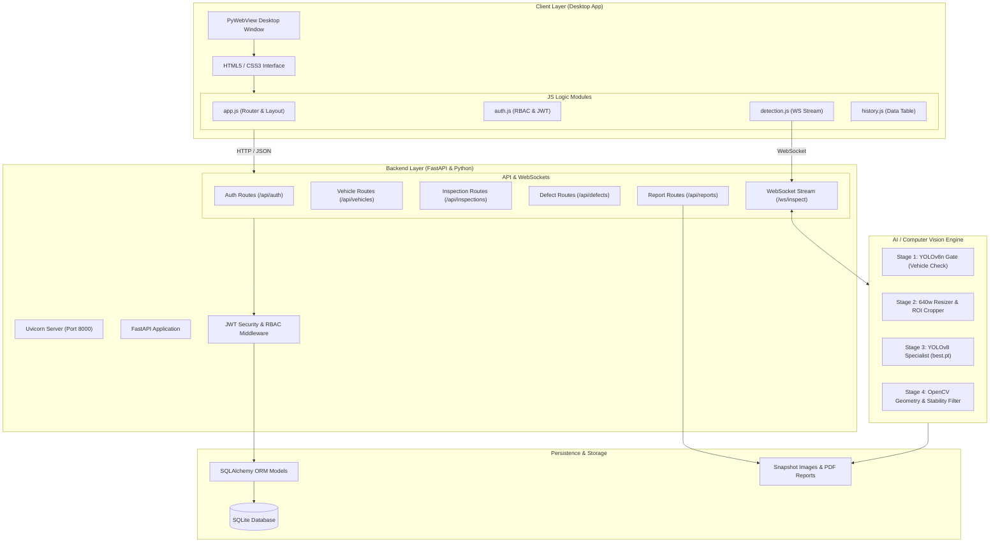
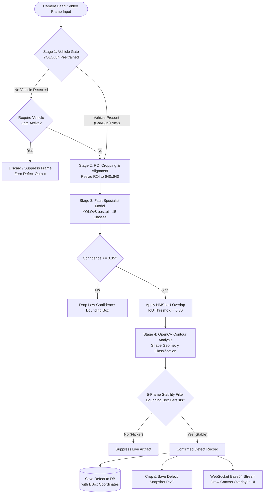
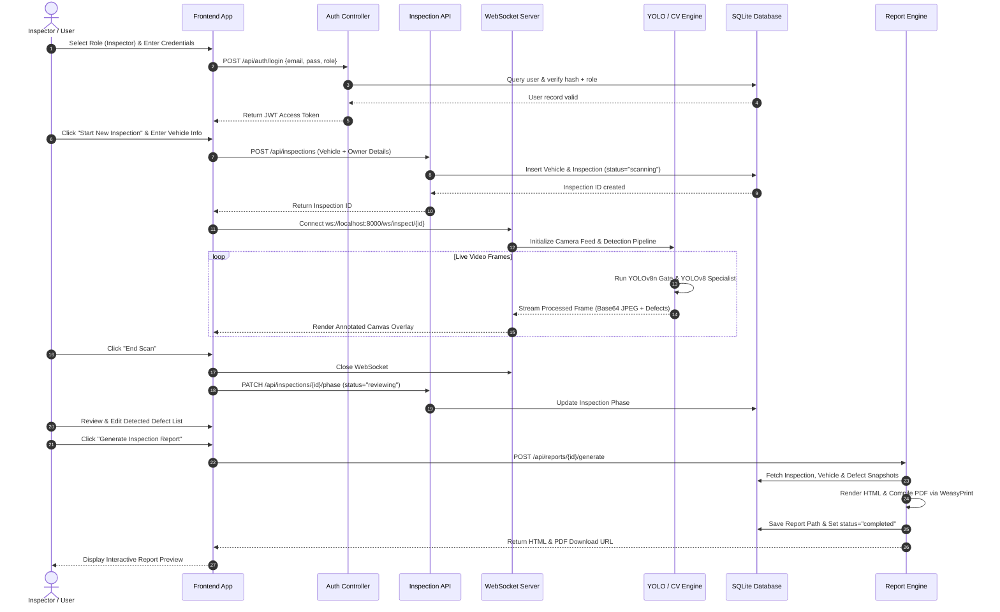
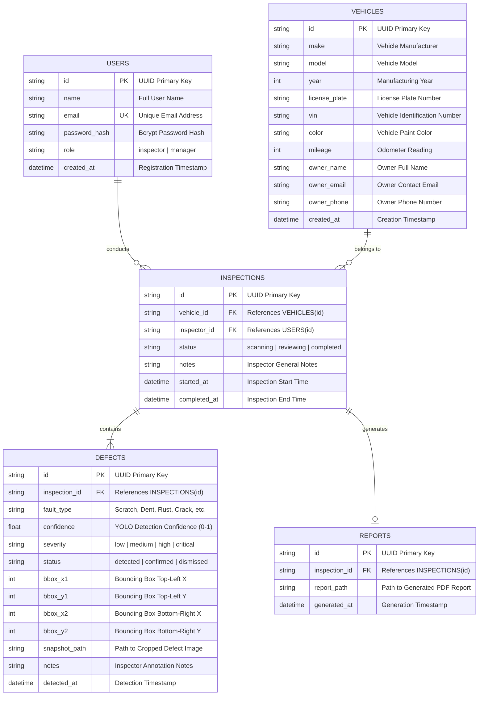
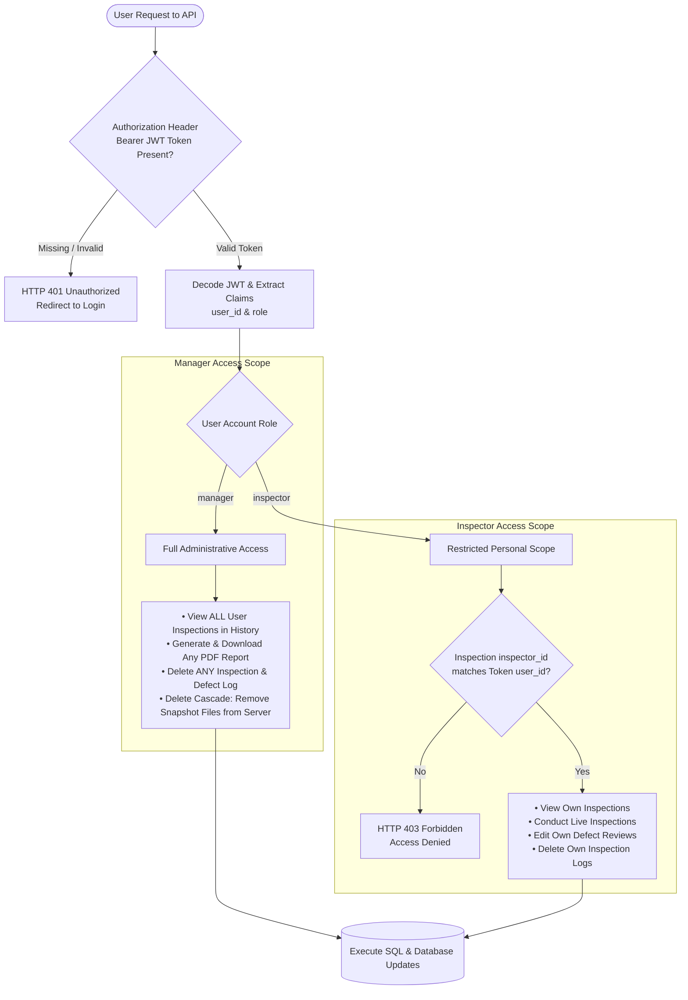

# System Architecture & Final Report Diagrams (draw.io / Mermaid)

This directory contains the essential software engineering, AI pipeline, database, and security diagrams created for the **AutoScan Pro Vehicle Inspection System** final report.

Each diagram is provided in clean Mermaid.js format, fully compatible with **draw.io** (diagrams.net), GitHub Markdown, and VS Code previews.

---

## Index of Diagrams

1. [System Architecture Diagram](#1-system-architecture-diagram) (`1_System_Architecture.mmd`)
2. [AI Computer Vision & Detection Pipeline](#2-ai-computer-vision--detection-pipeline) (`2_AI_Detection_Pipeline.mmd`)
3. [End-to-End Inspection Sequence Diagram](#3-end-to-end-inspection-sequence-diagram) (`3_Inspection_Workflow_Sequence.mmd`)
4. [Entity-Relationship Diagram (Database Schema)](#4-entity-relationship-diagram-database-schema) (`4_Database_ERD.mmd`)
5. [User Roles & Security Access Control (RBAC)](#5-user-roles--security-access-control-rbac) (`5_User_Roles_RBAC_Security.mmd`)
6. [Inspection Lifecycle State Machine](#6-inspection-lifecycle-state-machine) (`6_Inspection_Lifecycle_State_Machine.mmd`)

---

## 1. System Architecture Diagram

Represents the multi-tier desktop architecture: PyWebView Frontend, FastAPI Backend, OpenCV/YOLO Detection Engine, and SQLite Persistence Layer.

---

## 2. AI Computer Vision & Detection Pipeline

Illustrates the two-stage cascaded inference flow: YOLOv8n Vehicle Gate, 640w ROI Alignment, Custom Specialist (`best.pt`), Confidence/NMS filtering, OpenCV Contour Geometry Analysis, and the 5-Frame Temporal Stability Filter.

---

## 3. End-to-End Inspection Sequence Diagram

Details the step-by-step communication between Inspector, Frontend UI, Authentication, Inspection API, WebSocket Live Stream, Computer Vision Engine, Database, and WeasyPrint PDF Generation Engine.

---

## 4. Entity-Relationship Diagram (Database Schema)

Defines relational tables (`users`, `vehicles`, `inspections`, `defects`, `reports`) with primary keys, foreign keys, cardinality, and data types.

---

## 5. User Roles & Security Access Control (RBAC)

Demonstrates security middleware validation, JWT decoding, role verification (`inspector` vs `manager`), and cascaded snapshot file cleanup upon deletion.

---

## 6. Inspection Lifecycle State Machine

Maps out all operational states of a vehicle inspection from application launch to final report generation and history archiving.

```mermaid
stateDiagram-v2
    [*] --> Idle: Application Start

    state "Inspection Lifecycle" as Lifecycle {
        Idle --> Draft: Click "Start New Inspection"
        
        state Draft {
            [*] --> VehicleInput: Fill Make, Model, Year, Plate, VIN
            VehicleInput --> OwnerInput: Fill Owner Contact Info
            OwnerInput --> Confirm: Review Summary & Inspector Notes
        }

        Draft --> Scanning: Click "Start Inspection"

        state Scanning {
            [*] --> WSConnect: Establish WebSocket Stream
            WSConnect --> LiveInference: AI Camera Frame Processing
            LiveInference --> DefectLog: Detect & Log Faults + Snapshots
            DefectLog --> LiveInference: Next Video Frame
        }

        Scanning --> Reviewing: Click "End Scan"

        state Reviewing {
            [*] --> DefectGrid: Render Detected Bounding Boxes
            DefectGrid --> EditDefects: Add/Edit Severity, Status & Notes
            EditDefects --> CleanReportCheck: Clean Report or Defect Report
        }

        Reviewing --> GeneratingReport: Click "Generate Report"

        state GeneratingReport {
            [*] --> CompileHTML: Render HTML Template with Metadata
            CompileHTML --> WeasyPrintPDF: Convert HTML to PDF Document
            WeasyPrintPDF --> SaveReport: Save PDF File to /reports/
        }

        GeneratingReport --> Completed: Report Generation Success

        state Completed {
            [*] --> ViewReport: Display Interactive PDF/HTML Preview
            ViewReport --> HistoryTable: Record Saved in Inspection History
        }
    }

    Completed --> [*]: Inspection Workflow Complete
```

---

## How to Import into draw.io

1. Open **[draw.io (diagrams.net)](https://app.diagrams.net/)**.
2. Click **Arrange > Insert > Advanced > Mermaid...**
3. Paste the Mermaid content of any diagram above into the text box and click **Insert**.
4. You can edit, format, change colors, or export the resulting diagram as XML, PNG, SVG, or PDF for your final project documentation report.
